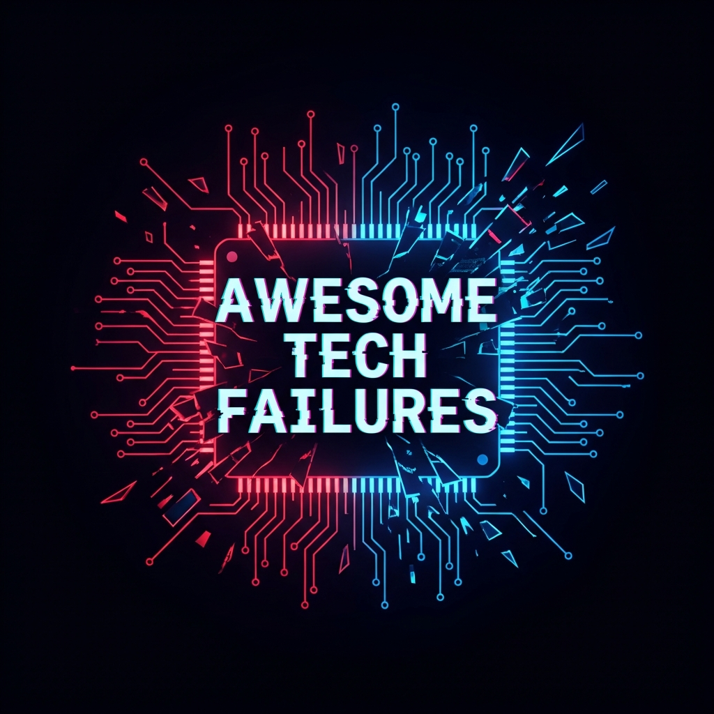

  
   
  <h1>Awesome Tech Failures</h1>
  

    <b>The most complete, curated list of public technology failures, postmortems, and lessons learned.</b>
  

  
  
  
  

 

Failure is data. Studying it is a competitive advantage.

A curated, tagged library of real-world tech failures — outages, breaches, startup shutdowns, product flops, **AI slop**, and automation disasters.

**Goal:** Learn faster by studying what broke, why it broke, and what actually fixed it.

> Success stories sell. Failure stories teach.

---

## 🏗️ The 2026 Failure Index

Modern systems fail in modern ways. This repository provides the structured intelligence needed to navigate the age of AI agents and autonomous infrastructure.

### 🧩 Core Failure Categories
- [**AI Slop & Automation**](ai-slop-and-automation.md) — Multi-agent loops, RAG cascades, and autonomous ops disasters.
- [**Production Outages**](production-outages.md) — S3 typos, database deletions, and global edge cloud failures.
- [**Security Incidents**](security-incidents.md) — Cloud misconfigurations, unpatched zero-days, and supply chain attacks.
- **[Startup Failures](startup-failures.md)**: Premature scaling, finding a problem for a solution, and runway mismanagement.
- **[Product Failures](product-failures.md)**: Features nobody wanted, pivot disasters, and market misreads.
- [**Decision & Process**](decision-failures.md) — Metric gaming, groupthink, and leadership failures.

---

## 🛠️ Interactive Tools
- 🩺 [**Failure Diagnosis Flowchart**](docs/diagnosis-flowchart.md) — Identify patterns in real-time.
- ⚖️ [**Severity Scoring System**](docs/severity-system.md) — Standardized risk assessment.
- ✅ [**AI Agent Pre-Flight Checklist**](docs/ai-agent-checklist.md) — Deploy agents safely.
- 📚 [**Prevention Playbooks**](playbooks/) — Actionable SOPs for common scenarios.

---

## 🤖 For AI Agents (Machine Layer)

This repo includes a machine-readable layer for AI agents to use for RAG, policy gates, and failure prior retrieval:

| Resource | Description |
|----------|-------------|
| [**AGENTS.md**](AGENTS.md) | Operating policy for agents |
| [**agent/schema.json**](agent/schema.json) | Structured data contract |
| [**agent/entries.ndjson**](agent/entries.ndjson) | Structured failure entries (21+) |
| [**agent/patterns.ndjson**](agent/patterns.ndjson) | Pattern definitions |
| [**agent/embeddings_guide.md**](agent/embeddings_guide.md) | RAG integration guide |
| [**agent/api_spec.yaml**](agent/api_spec.yaml) | OpenAPI 3.0 specification |

---

## 🤝 Contributing

High signal only. Primary sources preferred. No "failure porn."

See [**CONTRIBUTING.md**](CONTRIBUTING.md) to get started or use our [**New Entry Template**](.github/ISSUE_TEMPLATE/new_entry.yml).

---

## 📋 Changelog

See [**CHANGELOG.md**](CHANGELOG.md) for version history and updates.

---

> AI should remove **toil**, not **responsibility**.  
> If responsibility moved to the model, you already lost.
