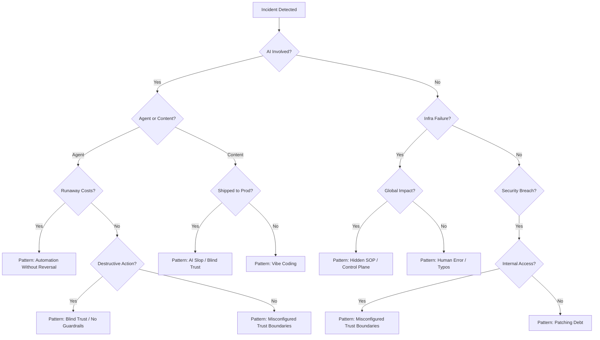

# Failure Diagnosis Flowchart 🩺

Use this flowchart to quickly categorize and identify recurring patterns when an incident occurs.

---

## High-Level Diagnosis

---

## Pattern-Specific Checklists

### 🤖 AI Agent Failures
- [ ] Was there a hard token/cost limit?
- [ ] Did the agent have write access without human-in-the-loop?
- [ ] Can the action be reversed (rollback/undo)?

### 🏗️ Infrastructure Outages
- [ ] Is there a hidden shared dependency?
- [ ] Was the safety mechanism disabled or bypassed?
- [ ] Is the recovery path (backups/DR) tested?

### 🔐 Security Incidents
- [ ] Is this a known vulnerability with an available patch?
- [ ] Was an internal service assumed to be "trusted"?
- [ ] Could network segmentation have limited the blast radius?
